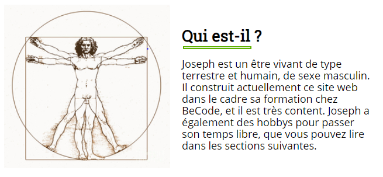
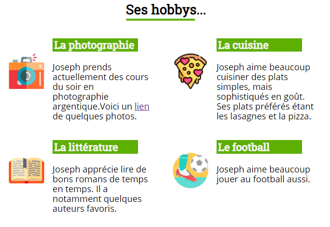

Second website of Ismail Joseph
=================================

Titre: Second Website
----------------------------------

*Exercice réalisé en janvier 2019, dans le cadre de ma formation [BeCode](https://www.becode.org/) de Web Developpeur de 7 mois, ayant commencé le 8 janvier 2019*

* Progression:
Ce site étant un des premiers exercices de Joseph, il peut être considéré comme terminé étant donné que Joseph préférait se concentrer sur des projets plus complets. Il reviendra éventuellement dessus pour s'entrainer ou s'amuser... Voir section "Changements"

* Contenu:
	* Ce site contient, en fond, quelques informations sur Joseph.

	* Dans la forme, il a été principalement construit en utilisant des concepts de base de HTML et CSS tels que les sélecteurs CSS, le floating, les figures, tableaux, footers, listes, et même quelques animations... Rien d'exceptionnel pour le moment.

* Quelques images d'illustrations:

* Un aperçu?

[Cliquez ici](https://fesouille.github.io/second_website/)

* Changements:
	* 21 janvier 2019: [first website](https://fesouille.github.io/first_website/) terminé
	* 03 février 2019: terminé

